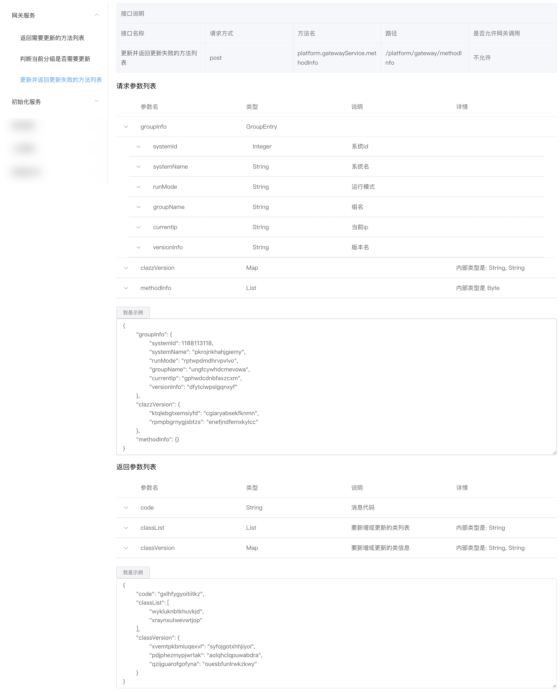

# 文档
1. 提供的文档和mock数据只有在开发环境有效

2. /info/clazz_list 提供如下结构的目录

> /info/clazz_list?system=10001

```json
[
    {
        "simpleName": "GatewayService",
        "fullName": "net.dloud.platform.common.client.GatewayService",
        "simpleComment": "网关服务",
        "methodInfo": [
            {
                "clazzName": "net.dloud.platform.common.client.GatewayService",
                "simpleName": "clazzInfo",
                "invokeName": "platform.gatewayService.clazzInfo",
                "invokeLength": 3,
                "simpleComment": "返回需要更新的方法列表"
            },
            {
                "clazzName": "net.dloud.platform.common.client.GatewayService",
                "simpleName": "groupInfo",
                "invokeName": "platform.gatewayService.groupInfo",
                "invokeLength": 1,
                "simpleComment": "判断当前分组是否需要更新"
            },
            {
                "clazzName": "net.dloud.platform.common.client.GatewayService",
                "simpleName": "methodInfo",
                "invokeName": "platform.gatewayService.methodInfo",
                "invokeLength": 3,
                "simpleComment": "更新并返回更新失败的方法列表"
            }
        ]
    },
    {
        "simpleName": "InitialService",
        "fullName": "net.dloud.platform.common.client.InitialService",
        "simpleComment": "初始化服务",
        "methodInfo": [
            {
                "clazzName": "net.dloud.platform.common.client.InitialService",
                "simpleName": "getSource",
                "invokeName": "platform.initialService.getSource",
                "invokeLength": 1,
                "simpleComment": "获取资源"
            }
        ]
    }
]
```

3. /info/method_detail 提供如下结构的详情数据

> /info/method_detail?system=10001&invokeName=platform.gatewayService.clazzInfo&invokeLength=3

```json
{
    "clazzName": "net.dloud.platform.common.client.GatewayService",
    "pathName": "/platform/gateway/clazzInfo",
    "invokeName": "platform.gatewayService.clazzInfo",
    "invokeLength": 3,
    "parameterInfo": [
        {
            "fieldName": "groupInfo",
            "simpleTypeName": "GroupEntry",
            "fullTypeName": "net.dloud.platform.common.domain.entry.GroupEntry",
            "innerType": false,
            "enquire": false,
            "genericTypeName": null,
            "genericTypeDepth": 0,
            "fieldList": [
                {
                    "fieldName": "systemId",
                    "simpleTypeName": "Integer",
                    "fullTypeName": "java.lang.Integer",
                    "innerType": true,
                    "enquire": false,
                    "genericTypeName": null,
                    "genericTypeDepth": 0,
                    "fieldList": null,
                    "simpleComment": "系统id",
                    "extendComment": null
                },
                {
                    "fieldName": "systemName",
                    "simpleTypeName": "String",
                    "fullTypeName": "java.lang.String",
                    "innerType": true,
                    "enquire": false,
                    "genericTypeName": null,
                    "genericTypeDepth": 0,
                    "fieldList": null,
                    "simpleComment": "系统名",
                    "extendComment": null
                },
                {
                    "fieldName": "runMode",
                    "simpleTypeName": "String",
                    "fullTypeName": "java.lang.String",
                    "innerType": true,
                    "enquire": false,
                    "genericTypeName": null,
                    "genericTypeDepth": 0,
                    "fieldList": null,
                    "simpleComment": "运行模式",
                    "extendComment": null
                },
                {
                    "fieldName": "groupName",
                    "simpleTypeName": "String",
                    "fullTypeName": "java.lang.String",
                    "innerType": true,
                    "enquire": false,
                    "genericTypeName": null,
                    "genericTypeDepth": 0,
                    "fieldList": null,
                    "simpleComment": "组名",
                    "extendComment": null
                },
                {
                    "fieldName": "currentIp",
                    "simpleTypeName": "String",
                    "fullTypeName": "java.lang.String",
                    "innerType": true,
                    "enquire": false,
                    "genericTypeName": null,
                    "genericTypeDepth": 0,
                    "fieldList": null,
                    "simpleComment": "当前ip",
                    "extendComment": null
                },
                {
                    "fieldName": "versionInfo",
                    "simpleTypeName": "String",
                    "fullTypeName": "java.lang.String",
                    "innerType": true,
                    "enquire": false,
                    "genericTypeName": null,
                    "genericTypeDepth": 0,
                    "fieldList": null,
                    "simpleComment": "版本名",
                    "extendComment": null
                }
            ],
            "simpleComment": null,
            "extendComment": null
        },
        {
            "fieldName": "newGroup",
            "simpleTypeName": "Boolean",
            "fullTypeName": "boolean",
            "innerType": true,
            "enquire": false,
            "genericTypeName": null,
            "genericTypeDepth": 0,
            "fieldList": null,
            "simpleComment": null,
            "extendComment": null
        },
        {
            "fieldName": "clazzInfo",
            "simpleTypeName": "List",
            "fullTypeName": "byte[]",
            "innerType": true,
            "enquire": false,
            "genericTypeName": [
                {
                    "simpleName": "List",
                    "typeName": "Byte",
                    "subTypeName": null,
                    "lastTypeName": null
                }
            ],
            "genericTypeDepth": 1,
            "fieldList": null,
            "simpleComment": null,
            "extendComment": "内部类型是 Byte"
        }
    ],
    "returnInfo": {
        "fieldName": "",
        "simpleTypeName": "GatewayMethodResult",
        "fullTypeName": "net.dloud.platform.common.domain.result.GatewayMethodResult",
        "innerType": false,
        "enquire": false,
        "genericTypeName": null,
        "genericTypeDepth": 0,
        "fieldList": [
            {
                "fieldName": "code",
                "simpleTypeName": "String",
                "fullTypeName": "java.lang.String",
                "innerType": true,
                "enquire": false,
                "genericTypeName": null,
                "genericTypeDepth": 0,
                "fieldList": null,
                "simpleComment": "消息代码",
                "extendComment": null
            },
            {
                "fieldName": "classList",
                "simpleTypeName": "List",
                "fullTypeName": "java.util.List",
                "innerType": true,
                "enquire": false,
                "genericTypeName": [
                    {
                        "simpleName": "String",
                        "typeName": "java.lang.String",
                        "subTypeName": null,
                        "lastTypeName": null
                    }
                ],
                "genericTypeDepth": 1,
                "fieldList": null,
                "simpleComment": "要新增或更新的类列表",
                "extendComment": "内部类型是: String"
            },
            {
                "fieldName": "classVersion",
                "simpleTypeName": "Map",
                "fullTypeName": "java.util.Map",
                "innerType": true,
                "enquire": false,
                "genericTypeName": [
                    {
                        "simpleName": "String",
                        "typeName": "java.lang.String",
                        "subTypeName": null,
                        "lastTypeName": null
                    },
                    {
                        "simpleName": "String",
                        "typeName": "java.lang.String",
                        "subTypeName": null,
                        "lastTypeName": null
                    }
                ],
                "genericTypeDepth": 1,
                "fieldList": null,
                "simpleComment": "要新增或更新的类信息",
                "extendComment": "内部类型是: String, String"
            }
        ],
        "simpleComment": null,
        "extendComment": null
    },
    "commentInfo": {
        "author": null,
        "title": null,
        "detail": "返回需要更新的方法列表",
        "params": null,
        "returned": null,
        "time": null,
        "exception": null
    },
    "injectionInfo": null,
    "permissionInfo": {
        "gateway": false,
        "allow": [
            "*"
        ],
        "deny": null,
        "level": 0,
        "limit": 0
    },
    "paramMock": "{\"groupInfo\":{\"systemId\":2040520573,\"systemName\":\"lmiagqwbelxhjzhi\",\"runMode\":\"hqguirrrzyeibppd\",\"groupName\":\"uggpzazzledicnfq\",\"currentIp\":\"jpqotvfevgyoqllc\",\"versionInfo\":\"ppgtwxzelqnovsgy\"},\"newGroup\":false,\"clazzInfo\":{}}",
    "returnMock": "{\"code\":\"mixicswcrxmghwsh\",\"classList\":[\"ddbhvcazfmvsdmhu\",\"waegqgqhndhptlpf\"],\"classVersion\":{\"rxwvrsflsfhffdep\":\"wuxqregkrfdpumuy\",\"xqolwszfwnnediww\":\"vcguhfstewcfbmwq\"}}",
    "createdAt": 1544417819000,
    "updatedAt": 1544417819000,
    "background": false,
    "whitelist": false
}
```

4. /info/method_mock 提供mock数据


5. 可以写个简单的页面解析接口提供的数据

