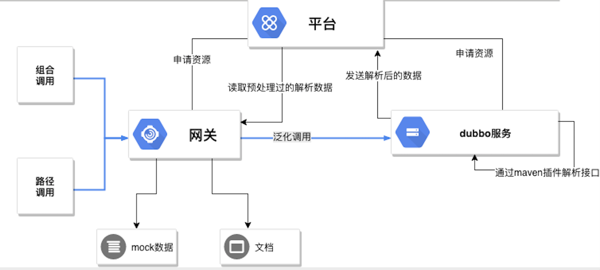

# 项目介绍
一个朴素的dubbo网关和平台基础组件

## 依赖组件
1. [Spring Cloud Gateway](quickstart/d1.spring-cloud-gateway.md)
2. [Apollo(配置中心)](quickstart/d2.config-center.md)
3. [Kafka(消息队列)](quickstart/d3.kafka-wrapper.md)
4. [ElasticJob(调度)](quickstart/d4.elasticjob-wrapper.md)

此外还依赖mysql和redis

## 实现部分
1. [dubbo软分组(通过LoadBalance)及异常处理](quickstart/i1.dubbo-soft-balance.md)
2. [基于JDT的maven插件，解析client包](quickstart/i2.maven-plugin.md)
3. [网关参数注入及接口数据自动解析](quickstart/i3.inject-and-parse.md)
4. [网关的两种调用方式：路径调用和组合调用](quickstart/i4.calling-mode.md)
5. [网关针对用户或ip的限流(令牌桶)](quickstart/i5.token-bucket.md)
6. [网关文档和mock数据](quickstart/i6.doc-and-mock.md)
7. [各系统的数据源由平台统一管理](quickstart/i7.source-by-platform.md)
8. [Redis、Kafka、Job的封装，具体使用见上](quickstart/i8.module-component.md)
9. [基于数据库的序列生成器](quickstart/i9.sequence-component.md)
10. [调试时使用的模拟网关](quickstart/i10.simple-gateway.md)
11. [简单的调用日志链路](quickstart/i11.simple-call-link.md)

## 未实现部分
1. 接口签名具体实现
2. 管理各个系统的数据源配置页面

## 附上主流程
